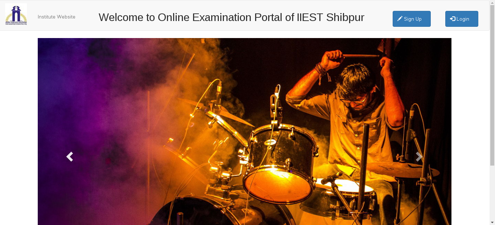
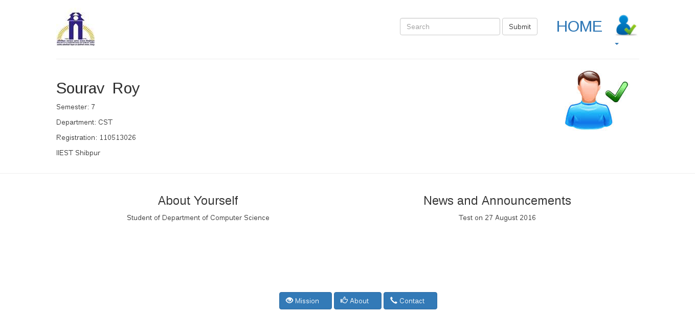

# Online-Examination-Portal
<h5> A simple Student - Teacher Departmental based online portal for a college/school</h5>
 
<h5>Students : </h5> <h6>Students can have their own homepage recognized by the university, showcasing their skills and projects. At the same time getting notifications from their respective teachers for a test</h6>
 
<h5>Faculty : </h5> <h6>Faculties too have their own homepage where they can manage their profile and the tests that they made and scheduled. Faculties are required to contribute to a Departmental Question Bank, from where the questions will be taken from during the creation of a test.</h6>    
 
 
<h5>Homepage</h5>

 
 
<h5>Students Page</h5>

